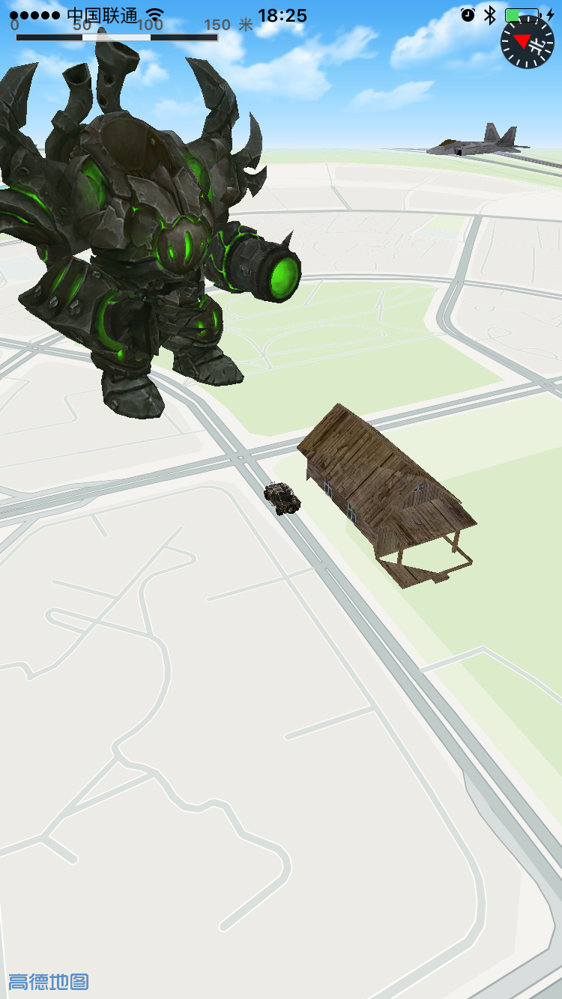

本工程主要介绍了 高德地图iOS SDK 3D版本 在基于地图的游戏方面的应用。
## 前述 ##

- [高德官方网站申请key](http://id.amap.com/?ref=http%3A%2F%2Fapi.amap.com%2Fkey%2F).
- 阅读[开发指南](http://lbs.amap.com/api/ios-sdk/summary/).
- 工程基于iOS 3D地图SDK实现

## 功能描述 ##
基于3D地图SDK，添加自定义3D模型。并对模型进行位移的操作

## 核心类/接口 ##
| 类    | 接口  | 说明   | 版本  |
| -----|:-----:|:-----:|:-----:|
| AMap3DObjectOverlay	| + (instancetype)objectOverlayWithCenterCoordinate:(CLLocationCoordinate2D)centerCoordinate size:(CLLocationDistance)size vertexPointer:(float *)vertexPointer normalPointer:(float *)normalPointer texCoordPointer:(float *)texCoordPointer vertsNum:(unsigned int)vertsNum; | 继承自NSObject<MAOverlay>，实现了设置coordinate | v4.0.0+ |
| AMap3DObjectOverlayRenderer	| - (void)glRender; | 自定义Overlay绘制模型的核心代码 | v4.0.0+ |

##效果图如下:

* 

## 核心难点 ##

``` objc

///自定义Overlay回调
- (MAOverlayRenderer *)mapView:(MAMapView *)mapView rendererForOverlay:(id <MAOverlay>)overlay
{
    if ([overlay isKindOfClass:[AMap3DObjectOverlay class]])
    {
        AMap3DObjectOverlay *objOverlay = (AMap3DObjectOverlay *)overlay;
        AMap3DObjectOverlayRenderer * reaverRenderer = [[AMap3DObjectOverlayRenderer alloc] initWithObjectOverlay:overlay];
        [reaverRenderer loadStrokeTextureImage:[UIImage imageNamed:objOverlay.textureName]];
        return reaverRenderer;
    }

    return nil;
}
```

``` objc

///初始化3D模型
- (void)airPlaneInit
{
    self.airPlaneOverlay = [AMap3DObjectOverlay objectOverlayWithCenterCoordinate:CLLocationCoordinate2DMake(39.984479, 116.494635) size:100 vertexPointer:raptorVerts normalPointer:raptorNormals texCoordPointer:raptorTexCoords vertsNum:raptorNumVerts];
    
    self.airPlaneOverlay.angle = 128;
    self.airPlaneOverlay.altitude = 10;
    self.airPlaneOverlay.textureName = @"FA-22_Raptor_P01";

    [self.mapView addOverlay:self.airPlaneOverlay];
}

```

``` objc

///核心模型绘制代码
- (void)glRender
{
    AMap3DObjectOverlay *objOverlay = self.objOverlay;

    if (_isNeedDoMoveCoordinate) {
        [self didMoveCoordinate];
    }

    if (objOverlay.vertsNum == 0)
    {
        return;
    }

    glEnable(GL_DEPTH_TEST);
    glDepthFunc(GL_LESS);

    glEnable(GL_BLEND);
    glBlendFunc(GL_SRC_ALPHA, GL_ONE_MINUS_SRC_ALPHA);

    glEnable(GL_TEXTURE_2D);
    glEnableClientState(GL_VERTEX_ARRAY);
    glEnableClientState(GL_TEXTURE_COORD_ARRAY);

    glBindTexture(GL_TEXTURE_2D, self.strokeTextureID);
    glColor4f(1, 1, 1, 1);

    glPushMatrix();

    if ([self.objOverlay.textureName isEqualToString:@"FA-22_Raptor_P01"] && objOverlay.altitude < 500) {
        _centerGL.z =  [self calculateSizeInGLReference] / objOverlay.size * objOverlay.altitude;
        objOverlay.altitude += 2;
    }
    
    glTranslatef(_centerGL.x, _centerGL.y, _centerGL.z);
    glRotatef(90, 1, 0, 0);

    glRotatef(objOverlay.angle, 0, 1, 0);
    if ([self.objOverlay.textureName isEqualToString:@"FelReaverMount"]) {
        objOverlay.angle += 1;
    }

    glScalef(_sizeGL, _sizeGL, _sizeGL);

    glVertexPointer(3, GL_FLOAT, 0, objOverlay.vertexPointer);
    glNormalPointer(GL_FLOAT, 0, objOverlay.normalPointer);
    glTexCoordPointer(2, GL_FLOAT, 0, objOverlay.texCoordPointer);

    glDrawArrays(GL_TRIANGLES, 0, objOverlay.vertsNum);

    glPopMatrix();

    glDisable(GL_TEXTURE_2D);
    glDisableClientState(GL_VERTEX_ARRAY);
    glDisableClientState(GL_TEXTURE_COORD_ARRAY);

    glDisable(GL_BLEND);
    glDisable(GL_DEPTH_TEST);

}

```


